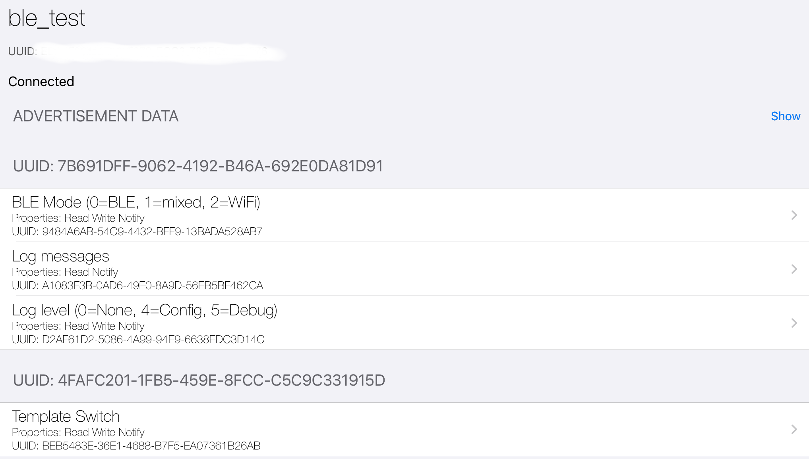
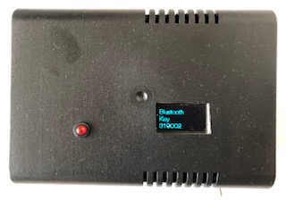

This component provides a Bluetooth Low Energy (BLE) controller for [ESPHome](https://esphome.io). It allows to monitor sensor data and control switches and other components via BLE connections (for example from a smart phone):



⚠️ **Note**: This controller only works with ESP32 micro-controllers, not with ESP8266 chips because they do not offer built-in BLE support.

## Installation
Copy the `esp32_ble_controller` directory into your ESPHome `custom_components` directory. (If you do not have such a directory yet, then create it in your ESPHome configuration directory, i.e. the directory storing your yaml files.)

## Configuration

### Getting started

The following configuration shows how to make a (template) switch accessible via BLE:
```yaml
switch:
  - platform: template
    name: "Template Switch"
    optimistic: true
    id: template_switch

esp32_ble_controller:
  services:
  - service: "4fafc201-1fb5-459e-8fcc-c5c9c331915d"
    characteristics:
      - characteristic: "beb5483e-36e1-4688-b7f5-ea07361b26ab"
        exposes: template_switch
```

You define your sensors, switches and other compoments as usual (like the [template switch](https://esphome.io/components/switch/template.html) in the example). 
Make sure to assign an id to each component you want to expose via bluetooth. 
Then you add `esp32_ble_controller` to include the controller itself. 
In order to make a component available you need to define a corresponding BLE characteristic that is contained in a BLE service. If you are not familiar with BLE you do need to worry much. For each characteristic and each service you simply need a different UUID, which you could generate [here](https://www.uuidgenerator.net). A service is basically used for grouping characteristics, so it can contain multiple characteristics. Each characteristic exposes a component, which is configured via the `exposes` property specifying the id of the respective component.

If you flash this example configuration and connect to your ESP32 device from your phone or tablet, you can see device information similar to the data displayed in the image above. Note how the service UUID and characteristic UUID provided in the characteristic configuration of the template switch now show up. Besides the switch that was configured explicitly there is also a so-called maintenance service which is provided by the controller automatically. It allows you to send commands to your device and access some logging related characteristics, which will be explained below.

### Configuration options

```yaml
esp32_ble_controller:
  services:
  - service: <service 1 UUID>
    characteristics:
      - characteristic: <characteristic 1.1 UUID>
        exposes: <id of component>
      - characteristic: <characteristic 1.2 UUID>
        exposes: <id of component>
  - service: <service 2 UUID>
    characteristics:
      - characteristic: <characteristic 2.1 UUID>
        exposes: <id of component>

  # you can add your own custom commands
  # The description is shown when the user sends "help test-cmd" as command.
  commands:
  - command: test-cmd
    description: just a test
    on_execute:
    - logger.log: "test command executed"

  # allows to enable or disable security, default is 'show_pass_key'
  # Options:
  # - none: 
  #     disables security
  # - show_pass_key: 
  #     upon first pairing the other device (your phone) sends a 6-digit pass key to the ESP and the ESP is supposed to display so that it can be entered on the other device
  security_mode: show_pass_key

  # automation that is invoked when the pass key should be displayed, the pass key is available in the automation as "pass_key" variable of type std::string
  # the example below just logs the pass keys
  on_show_pass_key:
  - logger.log:
      format: "pass key is %s"
      args: 'pass_key.c_str()'
  # automation that is invoked when the authentication is complete, the boolean "success" indicates success or failure
  on_authentication_complete:
  - logger.log:
      format: "BLE authentication complete %d" # shows 1 on success, 0 on failure
      args: 'success'
```

## Features

### BLE security

By default security is switched on, which means that the ESP32 has to be paired (bonded) when it is used for the first time with a new device. (This feature can be switched off via configuration.) Protection against man-in-the-middle attacks is enabled. The device to be paired sends a pass key (a 6 digit PIN) to the ESP32. Via the `on_show_pass_key` automation you can log the pass key or even show it on a display. (At the bottom you can find an example that makes use of a display to show the pass key until pairing is complete.)

### Maintenance service

The maintenance BLE service is provided implicitly when you include `esp32_ble_controller` in your yaml configuration. It provides two characteristics:

* Command channel (UTF-8 string, read-write):
Allows to send commands to the ESP32 and receives answers back from it. A command is a string which consists of the name of the command and (possibly) arguments, separated by spaces.
You can define your own custom commands in yaml as described above. A custom commmand consists of three parts: name, description (shown by help) and the `on_execute` automation that is executed when the command runs. A custom command can have arguments which are passed to the automation as a vector of strings named `arguments`.
There are also some built-in commands, which are always available:
  * help [command]:
    Without argument, it lists all available commands. When the name of a command is given like in "help log-level" it displays a specific description for this command.
  * ble-services [on|off]:
    Switches the component related (non-maintenance) BLE services on or off. You may wonder why one should switch off these services. On most ESP32 boards both BLE and WiFi share the same physical 2,4 GHz antenna on the ESP32. So, too much traffic on both of them can cause it to crash and reboot. Short-lived WiFi connections for sending MQTT messages work fine with services enabled. However, when connecting to the [web server](https://esphome.io/components/web_server.html) or for [OTA updates](https://esphome.io/components/ota.html) services should be disabled. 
  * log-level [level]: 
    If no argument is provided, it queries the current log level for logging over BLE. When a level argument is provided like in "log-level 0" the log level is adjusted. Currently the levels have to be specified as integer number between 0 (= no logging) and 7 (= very verbose).  
      ⚠️ **Note**: You cannot get finer logging than the overall log level specified for the [logger component](https://esphome.io/components/logger.html).
* Log messages (UTF-8 string, read-only):  
Provides the latest log message that matches the configured log level.

### Supported components

* [Binary sensor](https://esphome.io/components/binary_sensor/index.html) (read-only)
* [Sensor](https://esphome.io/components/sensor/index.html) (read-only)
* [Text sensor](https://esphome.io/components/text_sensor/index.html) (read-only)
* [Switch](https://esphome.io/components/switch/index.html) (read-write)

# Examples

Configuration to show the 6-digit pass key during authentication on a display:


```yaml
display:
  - platform: ...
    ...
    pages:
      - id: page_standard
        lambda: |-
          // print standard stuff
      - id: page_ble_pass_key
        lambda: |-
          it.print(0, 0, id(my_font), TextAlign::TOP_LEFT, "Bluetooth");
          it.print(0, 20, id(my_font), TextAlign::TOP_LEFT, "Key");
          it.print(0, 40, id(my_font), TextAlign::TOP_LEFT, id(ble_pass_key).c_str());

globals:
  - id: ble_pass_key
    type: std::string

esp32_ble_controller:
  services:
  - service: "4fafc201-1fb5-459e-8fcc-c5c9c331915d"
    characteristics:
      - characteristic: "beb5483e-36e1-4688-b7f5-ea07361b26ab"
        exposes: template_switch
  security_mode: show_pass_key
  on_show_pass_key:
    then:
      - lambda: |-
          id(ble_pass_key) = pass_key;
      - display.page.show: page_ble_pass_key
      - component.update: my_display
  on_authentication_complete:
    then:
      - lambda: |-
          id(ble_pass_key) = "";
      - display.page.show: page_standard
      - component.update: my_display
```
